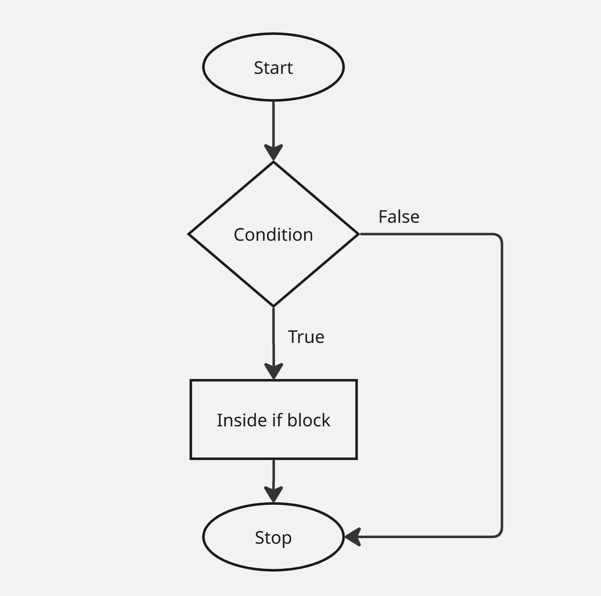
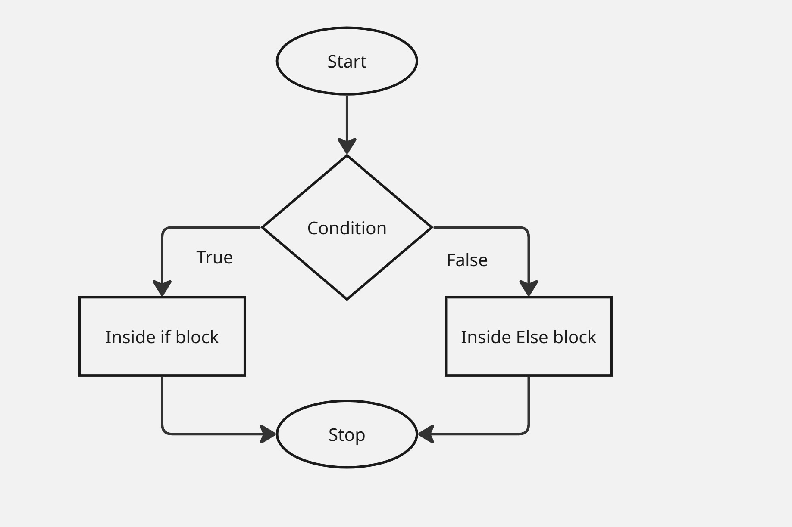
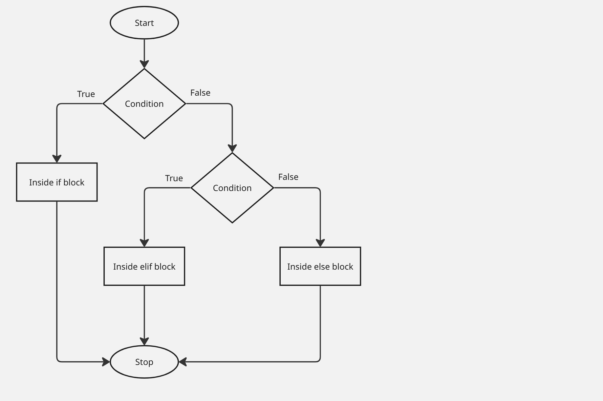

# Conditional Statements

Conditional statements in Python are used to execute certain blocks of code based on specific conditions.

---

## If Conditional Statement

If statement is the simplest form of a conditional statement. It executes a block of code if the given condition is true.

Syntax:-
```text
#statements
if condition == True:
  #statements
```

<p align="center">
The Flowchart of if conditional statement
</p>

<p align="center">

</p>


Example:-
```python
age = 25
if age >= 18:
    print("Eligible to vote.")
```
Output:-
```text
Eligible to vote.
```

## Short Hand if

Short-hand if statement allows us to write a single-line if statement.

Syntax:-
```text
#statements
if condition == True: #statements
```
Example:-
```python
age = 25
if age >= 18: print("Eligible to vote.")
```
Output:-
```text
Eligible to vote.
```
---

## if else condition Statement

If condition executes a block of code if the given condition is true.

Else condition provides a way to handle all other cases that don't meet the specified conditions.

Syntax:-
```text
#statements
if condition == True:
  #statements
else:
  #statements
```

<p align="center">The Flowchart of if-else conditional statement</p>

<p align="center"></p>

Example:-
```python
num = 26
if num % 5 == 0:
    print("It is multiple of 5.")
else:
    print("It is not multiple of 5.")
```
Output:-
```text
It is not multiple of 5.
```
## Short Hand if-else

Short-hand if-else statement allows us to write a single-line if statement.

Syntax:-
```text
#statements
if condition == True: #statements
```
Example:-
```python
age = 25
result = "It is multiple of 5" if age % 5 == 0 else "It is not multiple of 5"
print(result)
```
Output:-
```text
It is multiple of 5
```

---

## elif condition Statement

elif condition is nothing but **else if**. It is used when you want to check multiple conditions one by one.

Syntax:-
```text
if condition1:
    # block 1
elif condition2:
    # block 2
elif condition3:
    # block 3
else:
    # block 4
```

<p align="center">The Flowchart of elif conditional statement</p>

<p align="center"></p>

Example:-
```python
marks = 75

if marks >= 90:
    print("Grade A")
elif marks >= 75:
    print("Grade B")
elif marks >= 50:
    print("Grade C")
else:
    print("Fail")
```
Output:-
```text
Grade B
```
### Without elif
```
if marks >= 90:
    print("Grade A")

if marks >= 75:
    print("Grade B")
```
This may print multiple results, which is usually not what we want.

🔹Important Points to Remember:-
- elif must come after if
- You can use multiple elif
- else is optional
  
---

## Nested if else

A nested if-else is an if-else statement inside another if or else block.

Syntax:-
```text
if condition1:
    if condition2:
        # block A
    else:
        # block B
else:
    if condition2:
        # block A
    else:
        # block B
```

Example:-

```python
num = 10

if num > 0:
    if num % 2 == 0:
        print("Positive Even Number")
    else:
        print("Positive Odd Number")
else:
    print("Negative Number")
```
Output:-
```text
Positive Even Number
```
🔹 Important Points to Remember:-

- Indentation is very important
- Inner if runs only if outer if is True
- You can write only if inside an if or inside an else.You are not forced to use else.

---

## Ternary Conditional Statement

A ternary conditional statement is a short form of if–else written in one line.

It is also called:
- Conditional expression
- One-line if–else

Syntax:-
```
value_if_true if condition else value_if_false
```

Example:-
```python
num = 10

result = "Even" if num % 2 == 0 else "Odd"

print(result)
```
Output:-
```
Even
```

🔹Multiple Conditions

```python
result = "A" if marks >= 90 else "B" if marks >= 75 else "C"
```

---

## Match Case

It is used to compare one value against multiple patterns.

Syntax:-
```python
match variable:
    case value1:
        # block 1
    case value2:
        # block 2
    case _:
        # default block
```

Example 1:-
```python
day = 2

match day:
    case 1:
        print("Monday")
    case 2:
        print("Tuesday")
    case 3:
        print("Wednesday")
    case _:
        print("Invalid day")
```
Output:-
```Tuesday```

Example 2:-
```python
grade = "B"

match grade:
    case "A":
        print("Excellent")
    case "B" | "C":
        print("Good")
    case _:
        print("Needs Improvement")
```

Output:-
```Good```

---
